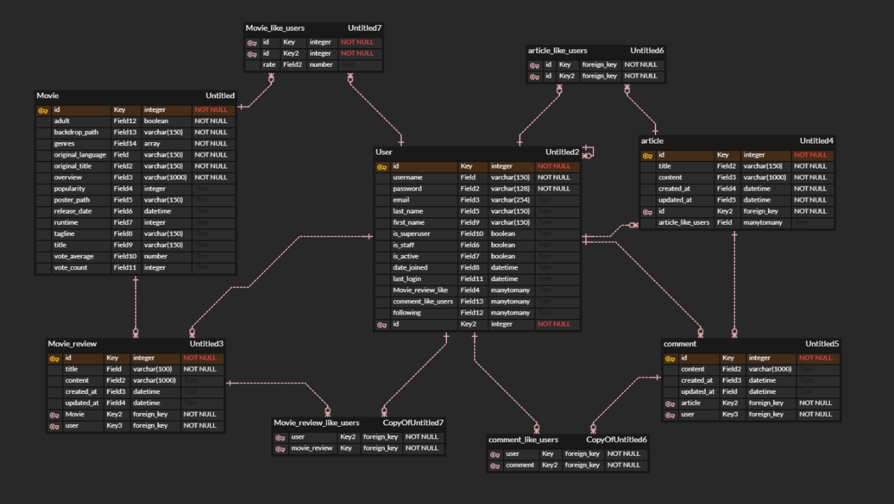

# Final Project

## Latte Cinema

세대 별 영화를 추천해주는 영화 사이트

## 팀원

### 팀장: 정성우

1) 프로필과 커뮤니티 관련된 백엔드 및 vue 프론트엔드
2) ppt 제작 및 발표

### 팀원 : 이주형

1. 영화 관련 백엔드 및 vue 프론트엔드
2. heroku와 netlify를 이용한 배포

## 목표 서비스 및 실제 구현

시대를 선택하여 그 시대의 영화를 보여주고 ui 요소를 시대에 맞게 변경, 사용자가 좋아하는 장르를 선별해 장르에 맞는 영화를 추천 및 검색

### 목표 기능

- ~~로그인~~
- ~~회원 가입~~
- ~~검색 버튼~~
- ~~연도 선택~~
- ~~커뮤니티 버튼~~
- ~~오늘의 영화~~
  - ~~객체 받아오기~~
  - ~~반투명 플레이 버튼 누르면 모달로 유튜브 예고편 자동재생~~
  - ~~유튜브 api로 예고편 가져오기~~
  - ~~html에 출력~~
- 최신글 / 인기글
- 최신리뷰 / 인기 리뷰
- ~~장르 별 영화 추천~~
- 백드롭 ~~유튜브~~
- ~~기본 정보 출력~~
- ~~배우 목록~~
- ~~평점 출력 (tmdb 평점, 라떼 평점)~~
- ~~리뷰 목록~~
- ~~내가 쓴 리뷰가 없으면 리뷰 create, 작성했으면 내가 쓴 리뷰 보여주기~~
- 리뷰 좋아요

- ~~특정 개별 장르 영화 전체를 표시~~
- 무한 스크롤로 계속 로딩 되도록
- 회원의 리뷰가 있으면 그 영화 안 보여주기

- ~~검색 창 띄우기~~
- ~~검색어에 맞는 영화 뽑기~~

- ~~유저가 작성한 게시글~~
- ~~유저가 추천한 게시글~~
- ~~유저가 작성한~~ ~~리뷰~~
- ~~팔로워, 팔로잉~~
- ~~본인 프로필 일때 보여주는 settings 기능~~

- ~~최신순, 인기순 정렬~~
- ~~페이지네이션~~
- ~~검색기능~~
- ~~글 작성 기능~~

- ~~추천 버튼~~
- ~~댓글 기능~~
- ~~댓글 추천 버튼~~


## ERD



1. User와 Movie, Article, Comment, Movie_review는 M:N관계를 갖는다.
2. Movie와 Movie_review는 1:N을 갖는다.
3. Article과 comment는 1:N을 갖는다.


## 기능

### 영화

#### 오늘의 영화 추천

랜덤한 영화 4개를 추천해주고 예고편을 띄워준다.

#### 장르 영화 추천

랜덤한 4개의 장르에 속하는 영화를 각 4개씩 추천하고 더보기로 그 장르의 영화를 살펴볼 수 있다.

#### 상세 영화 정보

영화 제목, 개요, tmdb 평점, 유저 평점, 개봉일을 확인할 수 있고 리뷰와 평점을 달 수 있다.

#### 영화 검색

영화 제목으로 검색을 할 수 있다.

### 커뮤니티

#### 게시판 글 작성 및 조회

게시판 글을 작성하고 댓글을 달고 추천할 수 있고 최신순, 인기순 게시글을 볼 수 있다.

게시글을 작성자나, 제목으로 검색도 가능하다.

### 프로필

로그인 한 사용자의 정보와 수정 그리고 작성한 게시글이나 추천 수 등 활동 내역을 볼 수 있다.

## 배포 URL

https://gleeful-lamington-74d42b.netlify.app/login

## 느낀 점

### 정성우

```
페이지 구성을 하는 설계 단계에서 상당한 시간이 필요함을 느꼈다. 디자인을 1도 안배운사람이 디자인을 하니 뭘해도 괜찮아 보였고, 그 결과 실제 사용을 해봤을때 직관성이나 다른 부분이 떨어져 ux가 썩 좋지 못함을 느꼈다.
스스로 디자인 해가며 구현도 해보고, 다른 사람이 만들어둔 템플릿도 사용해본 결과,
디자이너를 괜히 뽑는게 아니다 라는 생각이 들었다. 마지막 프로젝트를 하면서 느낀것은
백엔드 프론트엔드 배포 까지, 사실상 풀스택 개발이였다. 커리큘럼이 한학기 동안 하기엔 정말
힘들고 빠듯한 일정임이 틀림없지만 그럼에도 불구하고, 이 과정을 소화해내는 교육생들을 보니
다시금 대단한 사람들이구나를 느꼈다. 여태껏 서버가 필요한 작업을 많이 해보지 못했고 배포까지 해볼 구조도 아니였고 기회도 없었기에 이번에 상당히 많은것을 얻어 갔다고 생각된다. 이번 결과물이 구현 못한 기능들이 많아 만족스럽지는 않았지만, 다음 프로젝트의 결과물은 이거보단 나을것이 틀림 없을것 이다
```

### 이주형

```
기회을 야심차게 했는데 완벽하게 구현해내지 못해서 아쉬움을 느꼈습니다. 시간이 조금 더 있었더라면 좋겠다고 팀원과 함께 아쉬워했습니다. 처음에는 프론트와 백을 나누어서 진행을 한다고 생각했는데 곧바로 경계가 무너지고 함께 작업을 하는 방식으로 바꾸어서 서로 배워가는 시간을 가져서 좋았습니다. 또한 git, pigma 그리고 erdcloud를 이용하면서 협업 능력을 키울 수 있었습니다. 아쉽게나마 배포 또한 진행하여서 전과정을 경험할 수 있는 마지막 프로젝트에서 많은 것을 배워갑니다.
```


